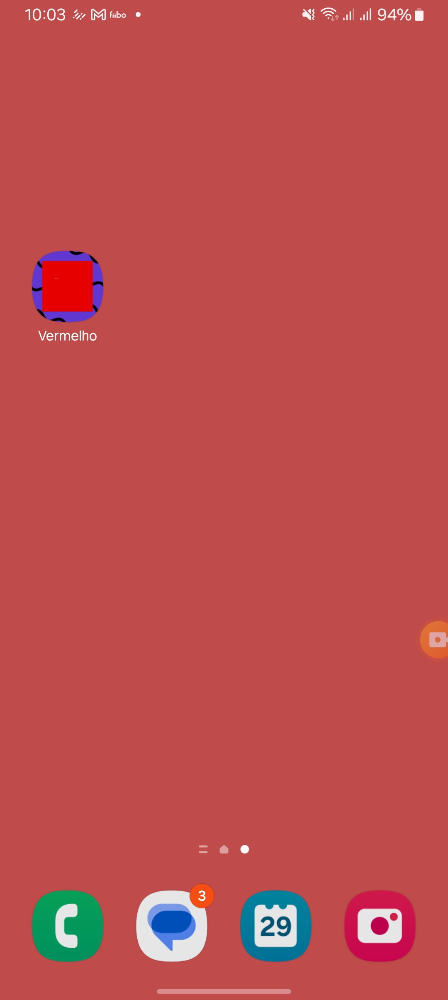
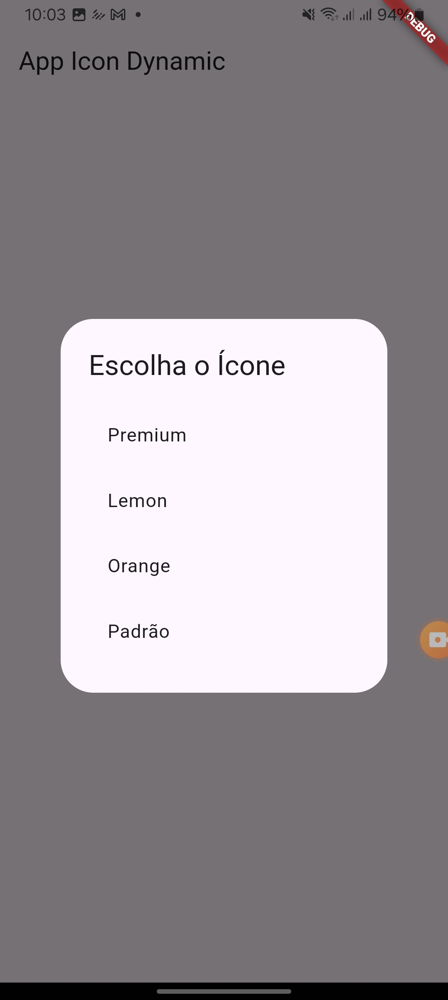
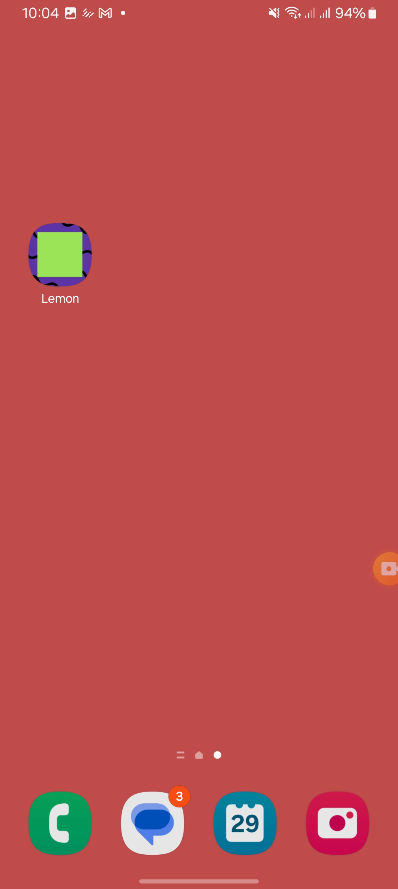

# 📱 Personalização de Ícones e Splash Screen no Flutter / Icon and Splash Screen Customization in Flutter

Este projeto implementa a **mudança dinâmica de ícones e splash screen** no Flutter, permitindo ao usuário selecionar um novo ícone para o app e refletir essa escolha ao reiniciá-lo.

This project implements **dynamic icon and splash screen change** in Flutter, allowing the user to select a new app icon and reflect that choice upon restarting the app.

## ✨ **Funcionalidades / Features**
- ✅ **Troca de ícone / Icon Change**: O usuário pode escolher um ícone personalizado. / The user can select a custom icon.
- ✅ **Troca de legenda (label do app) / App Label Change** junto com o ícone. / along with the icon.
- ✅ **Persistência da seleção / Selection Persistence**: O ícone escolhido é salvo e aplicado na próxima abertura do app. / The selected icon is saved and applied on the next app launch.
- ✅ **Compatibilidade Android & iOS / Android & iOS Compatibility**: Implementação para ambos os sistemas. / Implementation for both systems.
- ✅ **Mudança de Splash Screen / Splash Screen Change** no iOS e Android baseada no ícone escolhido. / on iOS and Android based on the selected icon.
- ✅ **Separado por Flavors/Schemas / Separated by Flavors/Schemas**: A funcionalidade pode ser habilitada apenas para um flavor/schema específico. / The functionality can be enabled only for a specific flavor/schema.

## 📱 **Demonstração / Demonstration**

| Selecionando um ícone / Selecting an icon | Reiniciando o app / Restarting the app | Novo ícone aplicado / New icon applied |
|---|---|---|
|  |  |  |

| Vídeo / Video|
|---|
|  |

## 🛠 **Configuração e Instalação / Setup and Installation**

### **1️⃣ Clonando o Repositório / Cloning the Repository**
```bash
git clone https://github.com/seu-usuario/seu-repositorio.git
cd seu-repositorio
```

### **2️⃣ Instalando as Dependências / Installing Dependencies**
```bash
flutter pub get
```

---

## ⚙️ **Configuração no Android / Android Setup**
### **Ativar Aliases no Manifest / Enable Aliases in the Manifest**
No arquivo `AndroidManifest.xml`, defina os aliases dos ícones alternativos:

In the `AndroidManifest.xml` file, define aliases for alternative icons:

```xml
<activity-alias android:name=".PremiumActivity"
    android:label="App Premium"
    android:enabled="false"
    android:exported="true"
    android:icon="@mipmap/ic_launcher_premium"
    android:targetActivity=".MainActivity">
    <intent-filter>
        <action android:name="android.intent.action.MAIN" />
        <category android:name="android.intent.category.LAUNCHER" />
    </intent-filter>
</activity-alias>
```

### **Permissões Necessárias / Required Permissions**
Adicione a seguinte permissão no `AndroidManifest.xml`:

Add the following permission to `AndroidManifest.xml`:
```xml
<uses-permission android:name="android.permission.CHANGE_COMPONENT_ENABLED_STATE" />
```

### **Configurar Flavors (Opcional) / Configure Flavors (Optional)**
Se quiser ativar a mudança de ícones apenas para um flavor, configure o `build.gradle`:

If you want to enable icon change only for a specific flavor, configure `build.gradle`:
```gradle
android {
    flavorDimensions "default"
    productFlavors {
        default {
            dimension "default"
            applicationIdSuffix ".default"
        }
        premium {
            dimension "default"
            applicationIdSuffix ".premium"
        }
    }
}
```

---

## 🍏 **Configuração no iOS / iOS Setup**

### **Ativar Suporte a Ícones Alternativos / Enable Support for Alternate Icons**
No `Info.plist`, defina os ícones alternativos:

In `Info.plist`, define the alternate icons:
```xml
<key>CFBundleAlternateIcons</key>
<dict>
    <key>PremiumIcon</key>
    <dict>
        <key>CFBundleIconFiles</key>
        <array>
            <string>PremiumIcon</string>
        </array>
    </dict>
    <key>LemonIcon</key>
    <dict>
        <key>CFBundleIconFiles</key>
        <array>
            <string>LemonIcon</string>
        </array>
    </dict>
</dict>
```

---

## 🚀 **Rodando o App / Running the App**

### **Android**
```bash
flutter run --flavor premium
```

### **iOS**
```bash
flutter run --flavor premium --target=lib/main_premium.dart
```

---

## 📜 **Licença / License**
Este projeto está sob a licença MIT - veja o arquivo [LICENSE](LICENSE) para mais detalhes.

This project is licensed under the MIT license - see the [LICENSE](LICENSE) file for details.

---

## 📬 **Contato / Contact**
Dúvidas ou sugestões? Entre em contato!

Questions or suggestions? Get in touch!
📧 Email: [alexmaciel.mail@gmail.com](mailto:alexmaciel.mail@gmail.com)  
💼 LinkedIn: [Alex Maceil](https://www.linkedin.com/in/alex-maciel-867b8933/)

